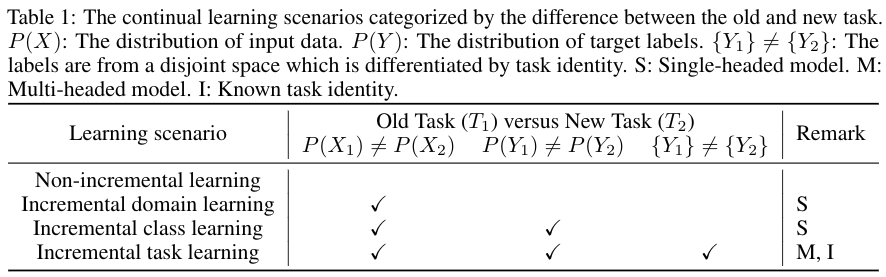
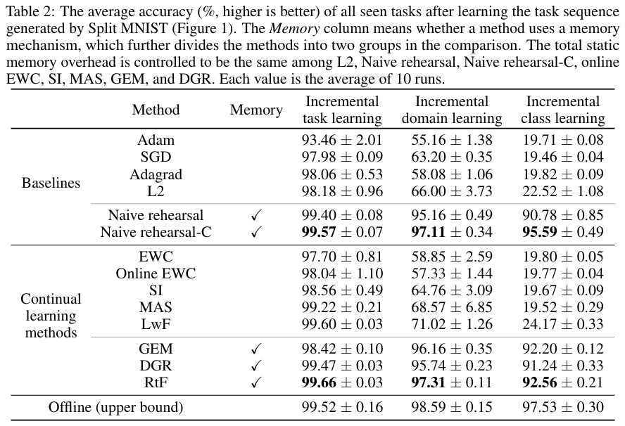

# Continual-Learning-Benchmark
Evaluate three types of task shifting with popular continual learning algorithms.

This repository implemented and modularized following algorithms with PyTorch:
- EWC: [code](https://github.com/GT-RIPL/Continual-Learning-Benchmark/blob/master/agents/regularization.py), [paper](https://arxiv.org/abs/1612.00796) (Overcoming catastrophic forgetting in neural networks)
- Online EWC: [code](https://github.com/GT-RIPL/Continual-Learning-Benchmark/blob/master/agents/regularization.py), [paper](https://arxiv.org/abs/1805.06370) 
- SI: [code](https://github.com/GT-RIPL/Continual-Learning-Benchmark/blob/master/agents/regularization.py), [paper](https://arxiv.org/abs/1703.04200) (Continual Learning Through Synaptic Intelligence)
- MAS: [code](https://github.com/GT-RIPL/Continual-Learning-Benchmark/blob/master/agents/regularization.py), [paper](https://eccv2018.org/openaccess/content_ECCV_2018/papers/Rahaf_Aljundi_Memory_Aware_Synapses_ECCV_2018_paper.pdf) (Memory Aware Synapses: Learning what (not) to forget)
- GEM: [code](https://github.com/GT-RIPL/Continual-Learning-Benchmark/blob/master/agents/exp_replay.py), [paper](https://arxiv.org/abs/1706.08840) (Gradient Episodic Memory for Continual Learning)
- (More are coming)

All the above algorithms are compared to following baselines with **the same static memory overhead**:
- Naive rehearsal: [code](https://github.com/GT-RIPL/Continual-Learning-Benchmark/blob/master/agents/exp_replay.py)
- L2: [code](https://github.com/GT-RIPL/Continual-Learning-Benchmark/blob/master/agents/regularization.py), [paper](https://arxiv.org/abs/1612.00796)

Key tables:

</a>
</a>

Reference:
```
@article{Hsu18_EvalCL,
  title={Re-evaluating Continual Learning Scenarios: A Categorization and Case for Strong Baselines},
  author={Yen-Chang Hsu and Yen-Cheng Liu and Anita Ramasamy and Zsolt Kira},
  booktitle={NeurIPS Continual learning Workshop },
  year={2018},
  url={https://arxiv.org/abs/1810.12488}
}
```

## Preparation
This repository supports PyTorch 1.0, Python 2.7, 3.6, and 3.7.

```bash
pip install -r requirements.txt
```

## Demo
The scripts for reproducing the results of this paper are under the scripts folder.

- Example: Run all algorithms in the incremental domain scenario with split MNIST.
```bash
./scripts/split_MNIST_incremental_domain.sh 0
# The last number is gpuid
# Outputs will be saved in ./outputs
```

- Eaxmple outputs: Summary of repeats
```text
===Summary of experiment repeats: 3 / 3 ===
The regularization coefficient: 400.0
The last avg acc of all repeats: [90.517 90.648 91.069]
mean: 90.74466666666666 std: 0.23549144829955856
```

- Eaxmple outputs: The grid search for regularization coefficient
```text
reg_coef: 0.1 mean: 76.08566666666667 std: 1.097717733400629
reg_coef: 1.0 mean: 77.59100000000001 std: 2.100847606721314
reg_coef: 10.0 mean: 84.33933333333334 std: 0.3592671553160509
reg_coef: 100.0 mean: 90.83800000000001 std: 0.6913701372395712
reg_coef: 1000.0 mean: 87.48566666666666 std: 0.5440161353816179
reg_coef: 5000.0 mean: 68.99133333333333 std: 1.6824762174313899

```

## Usage
- Enable the grid search for the regularization coefficient: Use the option with a list of values, ex: -reg_coef 0.1 1 10 100 ...
- Repeat the experiment N times: Use the option -repeat N

Lookup available options:
```bash
python iBatchLearn.py -h
```
